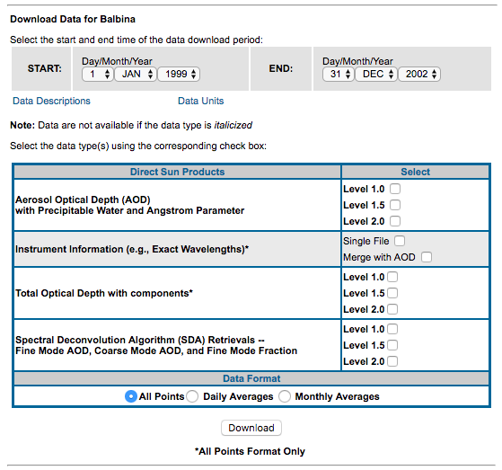
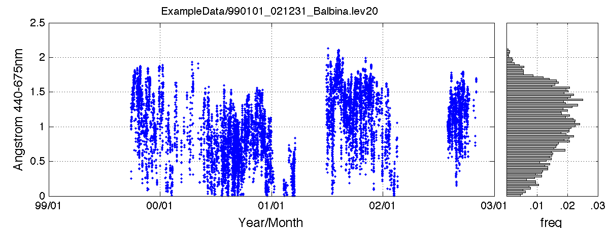
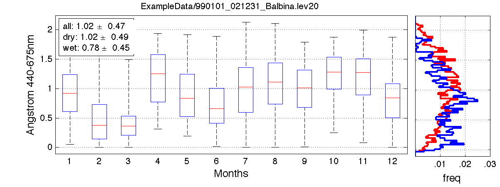
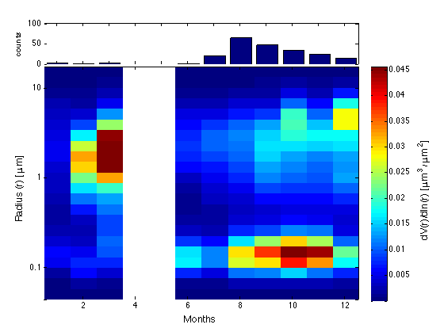
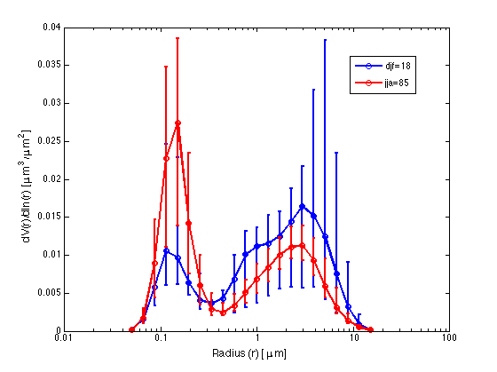

# aeronet
---

These are my personal Matlab routines to analyze NASA Aeronet
sunphotometer data. Well, not really analyze, mostly read and
plot. Here is what you need to do.

First, go to the download page:

https://aeronet.gsfc.nasa.gov/cgi-bin/webtool_opera_v2_new

And select some station. You will be presented with a menu for
selecting the time interval, and also the products and level you
want. The page will look like this: 



When you select what you want and click on download, you'll get a zip
file with all the data inside. See the folder ExampleData/ for an
example. The file name will look like this:

YYMMDD_YYMMDD_SITE.something

This tables shows which files you get in each case:

|Option selected | File you get
|------| ----
|AOD Lev.1.0             |site_id.lev10                   |
|AOD Lev.1.5             |site_id.lev15                   |
|AOD Lev.2.0             |site_id.lev20                   |
|Inst. Single File       |site_id.solar_info              |
|Inst. Merge with AOD    |=> will be added to "lev" files   |
|Total OD Lev.1.0        |site_id.tot10                   |
|Total OD Lev.1.5        |site_id.tot15                   |
|Total OD Lev.2.0        |site_id.tot20                   |
|SDA Lev.1.0             |site_id.ONEILL_10               |
|SDA Lev.1.5             |site_id.ONEILL_15               |
|SDA Lev.2.0             |site_id.ONEILL_20               |

For each of these types of files, you have one routine to read it:

|Matlab routine | File it applies to
|------| ----
|aeronet_read_lev.m    |=> lev10, 15 or 20     |
|aeronet_read_tot.m    |=> tot10, 15 or 20     |
|aeronet_read_ONEILL.m |=> ONEILL_10, 15 or 20 |

Note that you also have the inversions download page:

https://aeronet.gsfc.nasa.gov/cgi-bin/webtool_opera_v2_inv

Which has many more download options. The table below lists the files
you get when you select each of the available variables.

|Option selected | File you get
|------| ----
|Aerosol Size Distribution	        |site_id.siz
|Complex Index of Refraction	    |site_id.rin
|Coincident Aerosol Optical Depth   |site_id.aot
|Volume Mean Radius, etc..          |site_id.vol
|Absorption Aerosol Optical Depth	|site_id.tab
|Extinction Aerosol Optical Depth	|site_id.aot2
|Single Scattering Albedo	        |site_id.ssa
|Asymmetry Factor	                |site_id.asy
|Phase Functions	                |site_id.pfn, site_id_fine.pfn and site_id_coarse_pfn
|Radiative Forcing	                |site_id.force
|Spectral Flux	                    |site_id.flux
|Combined File                      |site_id.dubovik

I did not write routines for reading all of these! I just did for the
ones I need, which is the size distritions and the absorption optical
depth. If you want to addapt one of my scripts to read the others
files, fell free to do so. I would be glad to review it and include it
in here.

## Examples 

If you have not done so yet, download the big zip
file (25Mb) and uncompress it. You should then have a folder
ExampleData/ with a bunch of files for 'Balbina' site inside.
The following files give examples of how you can read and plot the data:

```
example_plot_lev.m
example_plot_ONEILL.m
example_plot_siz.m
```

There are two more generic ploting function that are used in these. They
will either to a time series + a histrogram. Or a box plot (for each month)
and the histograms. The histograms are shown for differente seasons.
The functions are:

```
aeronet_plot_points.m
aeronet_plot_box.m
```

### Angstrom and Water vapour

Open Matlab and run ```example_plot_lev.m```. You will have plots for
Angstrom and Water Vapour, which will be made in two different styles (the
two scripts above). These will look like this:




### Size distribution

Now open Matlab and run the example script 'aeronet_plot_siz.m'.
You should get two plots for the size distributions.






